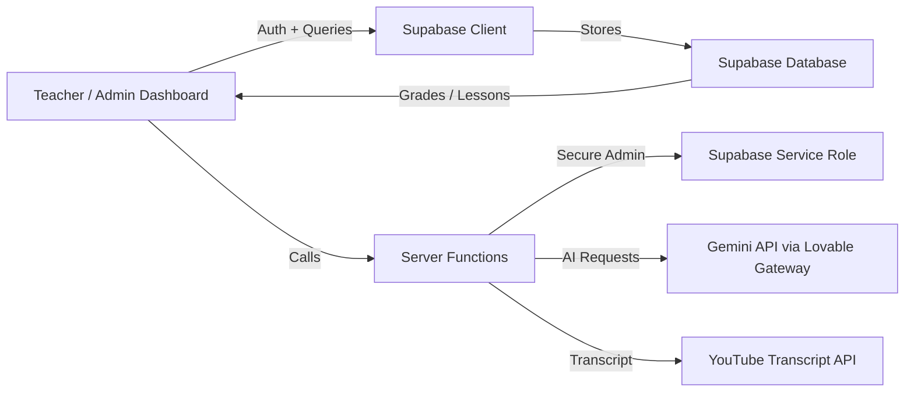

# AI PATHSHALA


## Product Overview

AI PATHSHALA is a modern AI-powered lesson creation SaaS built for educators and schools. It enables teachers to generate complete lesson plans, quizzes, worksheets, homework templates, and student announcements using AI, while centralizing class content and analytics in a polished web dashboard.

## Problem Solved

Teachers and curriculum designers spend too much time creating lesson materials, assessments, and student communications manually. This product reduces repetitive lesson planning work, streamlines content publishing, and helps schools deliver scalable AI-driven learning experiences.

## Solution Architecture

AI PATHSHALA is implemented as a hybrid React + server-function SaaS platform:

- **Client UI:** React 19 + Vite + TanStack Router + Tailwind
- **Auth & Data:** Supabase for authentication, role-based access, and lesson storage
- **AI services:** Gemini via Lovable AI Gateway for lesson generation, RapidAPI for YouTube transcript extraction, and Gemini image analysis for visual lesson source content
- **Export:** PDF/DOCX lesson and report generation in the browser
- **Hosting-ready:** Cloudflare Workers / Vite Cloudflare integration via Wrangler



## Features

- ✅ AI lesson generation with structured learning objects, quizzes, and homework
- ✅ YouTube transcript import for rapid lesson building
- ✅ Image-based lesson creation from diagrams, notes, or textbook pages
- ✅ Teacher and student role management using Supabase auth
- ✅ Export lessons and reports to PDF/DOCX
- ✅ Automated lesson announcements and email templates
- ✅ Subject curriculum suggestions for AI, Python, web development, robotics, and data science
- ✅ Responsive dashboard and lesson workflow for teachers, students, and principals

## Workflow Explanation

1. **Sign in / sign up** using Supabase authentication.
2. **Select subject, grade, and topic** from curated curriculum suggestions.
3. **Generate a lesson** using AI with optional source text, YouTube URL, or image upload.
4. **Review and edit** the generated lesson, worksheet, quiz, and homework content.
5. **Export** the lesson as PDF or DOCX for offline teaching.
6. **Notify students** with announcement emails or classroom updates.
7. **Track progress** through student and principal dashboards.

## Tech Stack

- Frontend: React 19, Vite, Tailwind CSS, TanStack Router
- Backend / Functions: `@tanstack/react-start`, Supabase server functions
- Database: Supabase Postgres
- AI: Gemini (via Lovable API gateway), RapidAPI transcript service
- Export: jsPDF, docx, html2canvas
- Deployment: Cloudflare Workers / Wrangler, Vite build

## Installation Steps

```bash
git clone <REPO_URL>
cd "AI PATHSHALA GIT REPO"/FrontEnd
npm install
cp .env.example .env
# update .env with your Supabase, Gemini, RapidAPI, and Lovable API keys
npm run dev
```

## Environment Variables

Create or update `FrontEnd/.env` with the following values:

```env
SUPABASE_URL="https://YOUR_SUPABASE_PROJECT.supabase.co"
VITE_SUPABASE_PROJECT_ID="YOUR_SUPABASE_PROJECT_ID"
VITE_SUPABASE_PUBLISHABLE_KEY="YOUR_SUPABASE_PUBLISHABLE_KEY"
SUPABASE_PUBLISHABLE_KEY="YOUR_SUPABASE_PUBLISHABLE_KEY"
SUPABASE_SERVICE_ROLE_KEY="YOUR_SUPABASE_SERVICE_ROLE_KEY"
LOVABLE_API_KEY="YOUR_LOVABLE_API_KEY"
GEMINI_API_KEY="YOUR_GEMINI_API_KEY"
RAPIDAPI_KEY="YOUR_RAPIDAPI_KEY"
```

> Note: keep all service keys private and do not commit `.env` to source control.

## Screenshots

| Dashboard | Lesson Creation |
|---|---|
|  |  |

| Lesson Library | Student Progress |
|---|---|
|  |  |

| Principal Overview |
|---|
|  |

## GIF Demos

- Lesson generation flow: `docs/demo-lesson-generation.gif`
- Student announcement and export workflow: `docs/demo-announcement-export.gif`

## Project Explainer Images

Below are two project explainer visuals included in this repository. They will render on GitHub and GitHub Pages when the changes are committed and pushed.

| Explainer 1 | Explainer 2 |
|---|---|
|  |  |


> Replace these placeholder paths with your actual GIF assets.

## Deployment Links

- Live App: `https://ai-pathshala.example.com`
- CI/CD: `https://github.com/<USERNAME>/<REPO>/actions`

> Update these links with the actual deployment URL and pipeline once deployed.

## Future Roadmap

- 🚀 Mobile app or PWA support for teacher and student access
- 🔧 LMS and Google Classroom integration
- 📊 Analytics dashboard for lesson usage and engagement
- 🤖 AI tutor chat and student feedback assistant
- 🌍 Multilingual lesson generation for global education
- 🧩 Collaboration tools for co-teaching and curriculum sharing

## Creator Information

Created by the AI PATHSHALA team.

- Portfolio: [Your Website](https://your-portfolio.example.com)
- Contact: hello@your-domain.example.com

## License

MIT License

> Add a `LICENSE` file or replace this section with your preferred open-source license.
